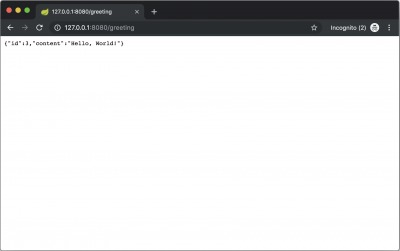

Build dart's development environment with vscode on docker by code-server


(1) run a docker image.
 
```
git clone https://github.com/kyorohiro/my-code-server.git
cd my-code-server/java_spring
docker build -t java_spring_vscode .
docker run -p 8443:8443 -p 8080:8080 -it java_spring_vscode bash
```

(2) run vscode at code-server

```
mkdir /works/w
/works/code-server /works/w --allow-http --no-auth
```

(3) and open 'http://127.0.0.1:8443/' at your browser 


## Install Plugin

(1)
https://marketplace.visualstudio.com/items?itemName=redhat.java


(2)

.vscode/settings.json

```
{
    "java.home": "/usr/lib/jvm/java-11-openjdk-amd64",
    "java.maven.downloadSources": true,
    "java.import.gradle.enabled": true,
    "java.errors.incompleteClasspath.severity": "warning",
    "java.configuration.updateBuildConfiguration": "automatic"
}
```


## RUN APPLICATION 

(1) Terminal -> New Terminal on VSCODE

(2) on Terminal

```
$ gradle init --type java-application
$ gradle build
```

(3) add eclipse plugin for redhat java plugin

```
plugins {
    id 'java'
    id 'application'
    id 'eclipse'
}

repositories {
    jcenter()
}

dependencies {
    implementation 'com.google.guava:guava:27.0.1-jre'
   testImplementation 'junit:junit:4.12'
}

mainClassName = 'hello.App'


```
$ gradle eclipse
$ gradle build
$ gradle run
```


# RUN Springboot

(1) modify build.gradle

```
buildscript {
    repositories {
        mavenCentral()
    }
    dependencies {
        classpath("org.springframework.boot:spring-boot-gradle-plugin:2.0.5.RELEASE")
    }
}

apply plugin: 'java'
apply plugin: 'eclipse'
apply plugin: 'idea'
apply plugin: 'org.springframework.boot'
apply plugin: 'io.spring.dependency-management'

bootJar {
    baseName = 'gs-rest-service'
    version =  '0.1.0'
}

repositories {
    mavenCentral()
}

sourceCompatibility = 11
targetCompatibility = 11

dependencies {
    compile("org.springframework.boot:spring-boot-starter-web")
    testCompile('org.springframework.boot:spring-boot-starter-test')
}
```


(2)  temporary run

```
$ gradle build
$ gradle eclipse
```

(3) src/main/java/hello/App.java

```
package hello;

import org.springframework.boot.SpringApplication;
import org.springframework.boot.autoconfigure.SpringBootApplication;

@SpringBootApplication
public class App {

    public static void main(String[] args) {
        SpringApplication.run(App.class, args);
    }
}
```

(4) src/main/java/hello/Greeting.java

```
package hello;

public class Greeting {
    private final long id;
    private final String content;

    public Greeting(long id, String content) {
        this.id = id;
        this.content = content;
    }

    public long getId(){
        return this.id;
    }

    public String getContent() {
        return this.content;
    }
}
```

(5) src/main/java/hello/GreetingController.java

```
package hello;

import java.util.concurrent.atomic.AtomicLong;
import org.springframework.web.bind.annotation.RequestMapping;
import org.springframework.web.bind.annotation.RequestParam;
import org.springframework.web.bind.annotation.RestController;

@RestController
public class GreetingController {

    private static final String template = "Hello, %s!";
    private final AtomicLong counter = new AtomicLong();

    @RequestMapping("/greeting")
    public Greeting greeting(@RequestParam(value="name", defaultValue="World") String name) {
        return new Greeting(counter.incrementAndGet(),
                            String.format(template, name));
    }
}
```

(6) RUN 

```
 $ SERVER_PORT=8080 SERVER_HOST=0.0.0.0 gradle tasks bootRun
```

(7) and, open 'http://127.0.0.1:8080/greeting' at your browser




