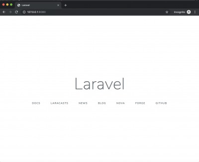

Build php x laravel's development environment with vscode on docker by code-server


# BASIC 

(1) run a docker image.
 
```
git clone https://github.com/kyorohiro/my-code-server.git
cd my-code-server/php_laravel
docker build -t php_laravel_vscode .
docker run -p 8443:8443 -p 8080:8080 -it php_laravel_vscode bash
```

(2) run vscode at code-server

```
mkdir /app/w
/app/code-server /app/w --allow-http --no-auth
```

(3) and open 'http://127.0.0.1:8443/' at your browser 


## VSCode setting 

https://code.visualstudio.com/docs/languages/php

https://laravel-news.com/tag/vscode

## Create Project


(1) Terminal -> New Terminal on VSCODE

(2) on Terminal

```
root@8e5699b9caa4:/works/w# composer create-project --prefer-dist laravel/laravel blog
root@8e5699b9caa4:/works/w# cd blog
root@8e5699b9caa4:/works/w# php artisan  serve --host 0.0.0.0 --port 8080

```

(3) and, open 'http://127.0.0.1:8080/' at your browser



