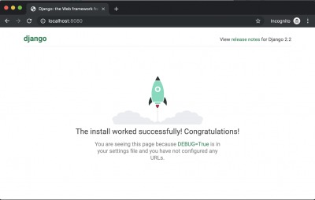

## HOW TO USE

(1)

```
$ docker-compose build
$ docker-compose up -d
```

(2) open browser http://127.0.0.1:8443


## VSCode setting 

https://marketplace.visualstudio.com/items?itemName=ms-python.python


## Create Project


(1) Terminal -> New Terminal on VSCODE

(2) on Terminal

```
root@8e5699b9caa4:/works/w# django-admin startproject mysite
root@8e5699b9caa4:/works/w# cd mtsite
root@8e5699b9caa4:/works/w# python manage.py runserver 0.0.0.0:8080
```

(3) and, open 'http://127.0.0.1:8080/' at your browser




## REF

### Tutorial

https://tutorial.djangogirls.org/

### mysql from vscode

```
$ mysql -uroot -hmysql -p
```

### plugin

https://marketplace.visualstudio.com/items?itemName=ms-python.python
https://code.visualstudio.com/docs/python/editing


https://code.visualstudio.com/docs/python/tutorial-django

https://stackoverflow.com/questions/45135263/class-has-no-objects-member

```
$pip install pylint-django

# .vscode/settings.json
{"python.linting.pylintArgs": [
     "--load-plugins=pylint_django"
],}
```
### type check

https://pypi.org/project/typeguard/

```
from typeguard import typechecked

@typechecked
def hello(message:str) -> str:
    print(str)


```