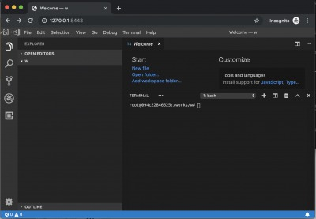

Build dart's development environment with vscode on docker by code-server


(1) run a docker image.
 
```
$ git clone https://github.com/kyorohiro/my-code-server.git
$ cd my-code-server/ssh_tunnel
# docker build . -t ssh_tunnel_vscode
# docker run -p 8443:8443 -p8080:8080 -p8022:22  -it ssh_tunnel_vscode  
```

(2) ssh login test

```
$ ssh root@127.0.0.1 -p 8022
```

(3) ssh tunnel
 
```
$ ssh -N -p 8022 root@127.0.0.1 -L 8081:127.0.0.1:8443 
```

(4) and open 'http://127.0.0.1:8443/' at your browser 




## Webdev


(1) Terminal -> New Terminal on VSCODE

(2) on Terminal

```
root@8e5699b9caa4:/works/w# pub get
root@8e5699b9caa4:/works/w# webdev serve --hostname=0.0.0.0
```

(3) and, open 'http://127.0.0.1:8080/' at your browser


